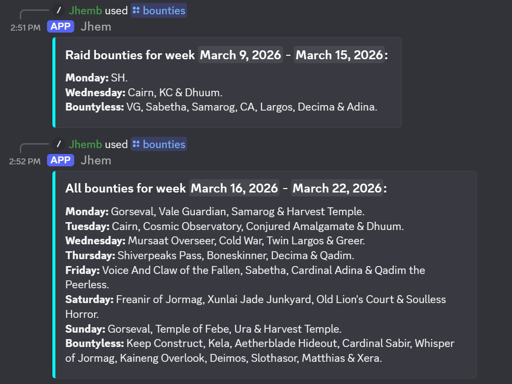
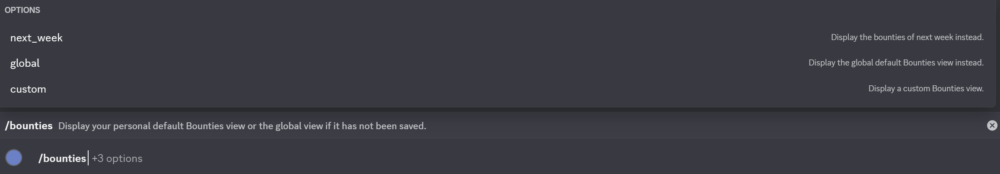
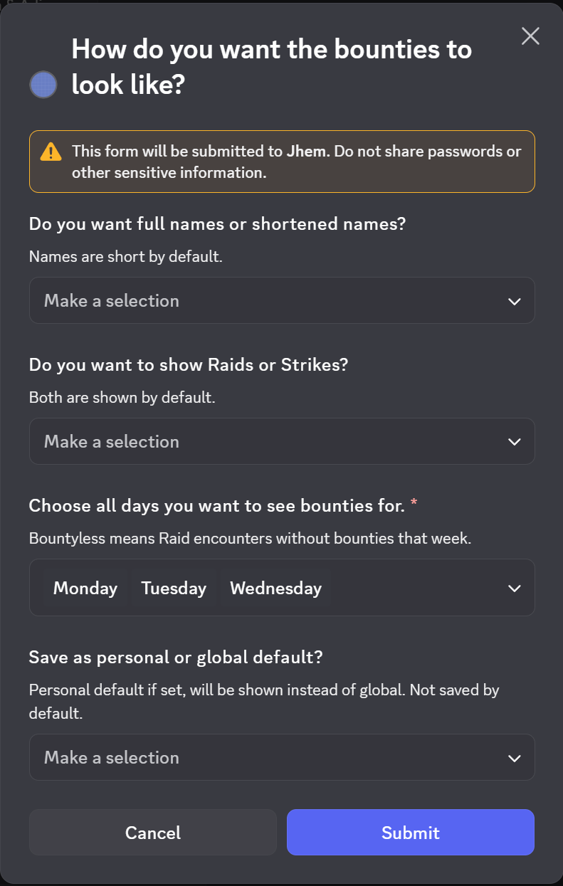

# Jhounty
###  Discord-bot for tracking daily Raid Bounties in Guild Wars 2.

## Features: 
  - ```/bounties``` displays bounties for the current or next week (using the ```next_week=true``` parameter).
  - The view can be customized and saved to a global view (server-wide) or a personal view (cross-server).
  - A saved personal view overrides the global view, but using the ```global=true parameter```, the global view can still be viewed. 
  - Configuration can be done using the ```custom=true``` parameter:
    - Long or Shortened names for each encounter.
    - Which types of bounties you want to show (Raids, Strikes or both).
    - Which days to show the bounties for. Can also choose to show which encounters don't have a bounty that week.
  - Once new encounters are added to the game, they can be added to the bot using the following commands:
    -  ```/add_bounty``` to add new a encounter to a bounty cycle.
    -  ```/remove_bounty``` to remove an encounter from a bounty cycle. (They might shuffle the cycles, so removing them might be necessary)
    -  ```/set_offset``` to set the current day in a cycle.
    -  ```/check_offsets``` and ```/check_bounty_cycles``` to show current offsets and cycles.
  - Personal views can be removed if the user wants to show the global bounty by default again using the ```/delete_personal_default``` command.
  - Dynamic timestamps for which week the bounties are for.
---
## Installation
1. Uses Node v24.12.0 and discord.js v14.25.1.
2. Install dependencies with ```npm install```.
3. Enter your Discord-bot token into config.json
4. Run the bot with ```node ./```.

---

## Some screenshots of the bot in action:

First view shows only Raid bounties for 2 chosen days of the week and Raids with no bounty, with shortened names and 2nd view shows the all bounties with full names for next week.



Options for the bounties command:



Customization modal for the bounties command:



---
ps. Yes, I know Raids and Strikes are now both called Raid encounters but they still feel distinctive of each other with differences of mechanics, flow and even rewards.